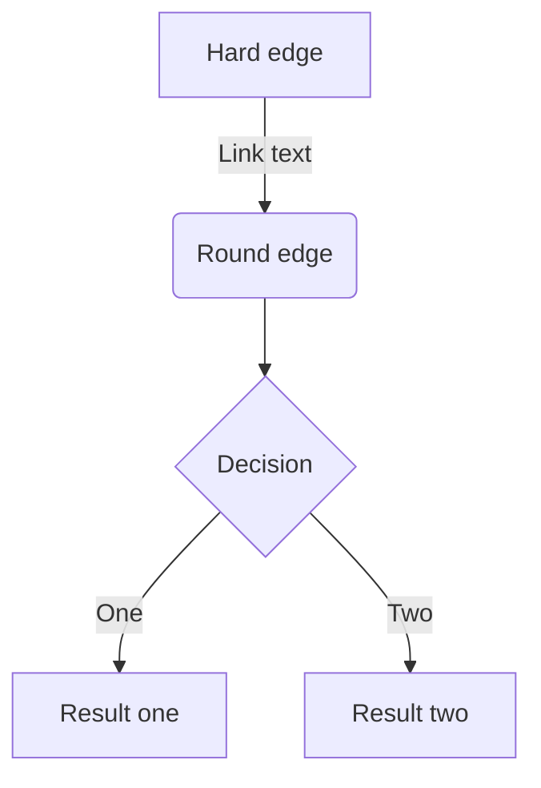

## 見出し 2

### 見出し 3

#### 見出し 4

- Hello!
- Hola!
  - Bonjour!
  * Hi!

1. First
2. Second

[アンカーテキスト](リンクのURL)


_キャプション_

[](リンクのURL)

| Head | Head | Head |
| ---- | ---- | ---- |
| Text | Text | Text |
| Text | Text | Text |

```js
const great = () => {
  console.log('Awesome')
}
```

```js:fooBar.js
const great = () => {
  console.log("Awesome")
}
```

```diff js
@@ -4,6 +4,5 @@
    const foo = bar.baz([1, 2, 3]) + 1;
    let foo = bar.baz([1, 2, 3]);
```

> 引用文
> 引用文

脚注の例[^1]です。インライン^[脚注の内容その 2]で書くこともできます。

[^1]:
    脚注の内容その 1
    下記区切り線

---

_イタリック_
**太字**
~~打ち消し線~~
インラインで`code`を挿入する

<!-- TODO: 自分用のメモ -->

:::message
メッセージをここに
:::

:::message alert
警告メッセージをここに
:::

:::details タイトル
表示したい内容
:::

::::details タイトル
:::message
ネストされた要素
:::
::::

# URL だけの行

https://zenn.dev/zenn/articles/markdown-guide

# GitHub のファイル URL またはパーマリンクだけの行（前後に改行が必要です）

https://github.com/TaMa-97/next_lilly/blob/main/lilly/next.config.js

# コードの開始行と終了行を指定

https://github.com/TaMa-97/next_lilly/blob/main/lilly/next.config.js#L1-L3

# コードの開始行のみ指定

https://github.com/TaMa-97/next_lilly/blob/main/lilly/next.config.js#L3



```mermaid
graph LR
   a --
```
